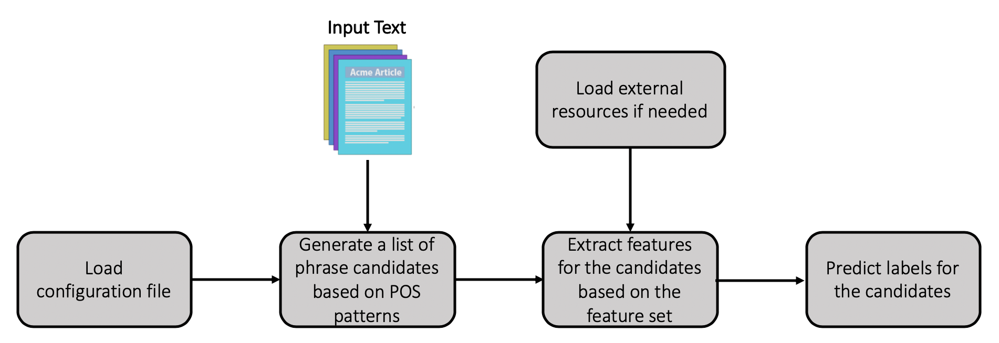

# Feature-based Keypharse Extraction

This project provides a flexible framework which can train domain-specific keyphrase extractors on label data. It provides an easy way to do feature engineering and currently supports 24 different types of features.

## Quick Links

- [Model](#model)
- [Installation](#installation)
- [Data](#data)
- [Usage](#usage)
- [Prediction](#prediction)

## Model

<p align="center"></p>

## Installation

Install spaCy and NLTK libraries for NLP, and scikit-learn library for machine learning mdoels.

## Data

The data includes two separate files: input text file and input label file.

The input text file follows the format: <doc_id>\<tab>\<text>
```
051_43462410	3/2-2 car garage this beautiful home has been completely renovated it is a corner lot and has new roof, air conditioning unit and duct work, new water heater garbage disposal, recess lighting, new kitchen and bathroom cabinets with granite tops, tile through out and carpet in bedrooms also boasts a beautiful fireplace in the large family room , also has formal large living room and formal dining room with eat in kitchen and separate laundry room and a screened in patio ,also new paint inside and out in neutral colors, it is conveniently located close to Wickham park, golf course ,shopping and groceries and minutes from the beach. This house is a must see!
052_2091939356	For those that want a downtown lifestyle with the amenities of a Resort Community, then this lot fits the bill. Located in the downtown district, yet $100,000 less than a lot you would pay for a block away. It offers you the convenience of walkability to the Main Street in town, the 5 acre park and the beautiful Town Beach, while also offering a Community Pool, Tennis Courts, Private Beach, Walking, Biking and Golf Cart trails within the resort community. Have the best of both worlds!
```

The input label file follows the format: <doc_id>\<tab>\<list_of_phrases>
```
051_43462410	['duct work', 'formal dining room', 'groceries', '3/2-2 car garage', 'shopping', 'paint inside and out', 'new roof', 'eat in kitchen', 'recess lighting', 'screened in patio', 'new kitchen', 'bathroom cabinets', 'new water heater', 'formal large living room', 'conveniently located', 'granite tops', 'large family room', 'new paint inside', 'new paint', 'neutral colors', 'beautiful fireplace', 'corner lot', 'cabinets with granite tops', 'carpet in bedrooms', 'separate laundry room', '2 car garage', 'shopping and groceries', 'beautiful home', 'tile through out', 'air conditioning unit', 'completely renovated', 'golf course', 'garbage disposal', 'close to Wickham park', 'minutes from the beach']
052_2091939356	['Community Pool', 'Walking', 'fits the bill', 'downtown district', 'resort community', 'Main Street in town', 'Resort Community', 'Walking, Biking', 'Main Street', 'Golf Cart trails', 'Biking', '5 acre park', 'Tennis Courts', 'convenience of walkability', 'beautiful Town Beach', 'Private Beach', 'amenities', 'downtown lifestyle']
```

## Usage
Config file (```config.json```): you can set different configurations for a model you want to train; for example, different sets of features.

We provide several scripts. The usages of these scripts can be accessed by the parameter ````-h````, i.e., 
```
python get_pos_patterns.py -h
python generate_corpus_statistics.py -h
python train.py -h
python predict.py -h
```

```get_pos_patterns.py```: if you already have a pre-defined part-of-speech patterns (e.g., "NN NN" or "JJ NNS"), you do not need to run this script. It helps to generate  patterns from label data and add to your current pre-defined file if a pattern does not exist.

```
python get_pos_patterns.py --text_file data/sample/train.texts.txt --label_file data/sampe/train.labels.txt --config_file model/files/config.json --pattern_file model/files/pos_patterns.txt
```

```generate_corpus_statistics.py```: if you want to use some statistic features which require the data from an entire corpus (e.g., collection term frequency or tf-idf), you need to run this script to generate a statistics file and then provide the file path in the config file.
```
python generate_corpus_statistics.py --input_file data/corpus.txt --output_file model/files/statistics.pkl --config_file model/files/config.json --pattern_file model/files/pos_patterns.txt
```

```train.py```: is to train a keyphrase extractor using Logistic Regression model. You can evaluate the performance of the model with split data or cross validation by specifying the parameters ```--split_data``` or ```--cross_validation```.
```
python predict.py --input_file data/sample/test.texts.txt --output_file output/output.txt --feature_file checkpoint/features.pkl --config_file model/files/config.json --pattern_file model/files/pos_patterns.txt --model_file checkpoint/logreg.model
```

## Prediction
```predict.py``` is provided to extract keyphrases from raw input text (described in [Data](#data) section). A running command example is provided below:

```
python predict.py --input_file data/sample/test.texts.txt --output_file output/output.txt --feature_file checkpoint/features.pkl --config_file model/files/config.json --pattern_file model/files/pos_patterns.txt --model_file checkpoint/logreg.model
```

The corresponding output follows the format: <doc_id>\<tab>\<list_of_keyphrases_and_their_locations>
```
001_43909949	[('1920s Old Spanish style', (32, 54)), ('home has grandeur', (167, 183)), ('glamourous Hollywood movie', (98, 123))]
002_241614909	[('entryway with a closet', (101, 122)), ('attached garage', (58, 72)), ('large walk in closet', (332, 351))]
```